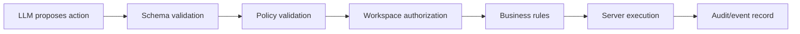

# AI Action Engine

Lead.AI does not allow an LLM to execute arbitrary operations.

The intended action path is:

Phase 2 implements this path in `src/server/actions/*` and exposes it through:

- `POST /api/workspaces/:workspaceId/actions`
- `POST /api/workspaces/:workspaceId/actions/simulate`
- `POST /api/workspaces/:workspaceId/agent/test`

Supported server-executable actions are:

- `create_lead`
- `update_lead_stage`
- `schedule_followup`
- `request_handoff`
- `add_customer_tag`
- `create_internal_note`

`request_booking` remains a known but unsupported high-risk action until a real
booking integration exists. Unsupported or malformed actions fail closed before
execution.

## Guarantees

- Every request is Firebase-authenticated and workspace-authorized.
- Every proposal is schema validated before policy evaluation.
- Risk is classified deterministically as low, medium, or high.
- Medium/high-risk actions require approval.
- Completed idempotency keys are not executed again.
- All mutations are bounded under `workspaces/{workspaceId}`.
- Lifecycle business events and audit logs are recorded for proposal,
  validation, approval-required, execution, completion, and failure.
- Simulation/test mode returns policy and expected effects without Firestore
  mutation.
