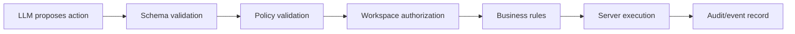

# AI Action Engine

Lead.AI does not allow an LLM to execute arbitrary operations.

The intended action path is:

P0 adds typed `AgentAction` primitives in `src/types/action.ts`.

Execution remains intentionally limited to the existing safe server paths: answer customer, create lead, update lead status, and request handoff through validated API logic.
