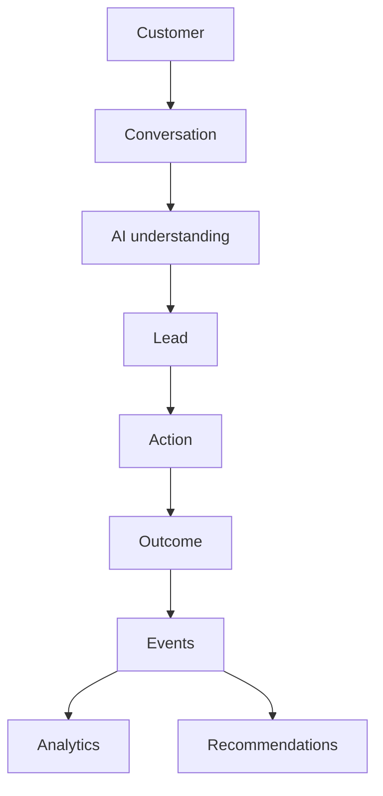

# Lead.AI 3.0 Architecture

Lead.AI 3.0 is organized around one tenant-scoped customer intelligence spine:



P0 implementation adds canonical customers and business events without replacing the existing Firebase Auth, workspace membership, approved knowledge, AI orchestration, analytics, or audit paths.

Primary Firestore paths:

```text
workspaces/{workspaceId}/customers/{customerId}
workspaces/{workspaceId}/leads/{leadId}
workspaces/{workspaceId}/conversations/{conversationId}
workspaces/{workspaceId}/conversations/{conversationId}/messages/{messageId}
workspaces/{workspaceId}/events/{eventId}
workspaces/{workspaceId}/knowledgeSources/{sourceId}
workspaces/{workspaceId}/agentActions/{actionId}
workspaces/{workspaceId}/automations/{automationId}
workspaces/{workspaceId}/automationRuns/{runId}
workspaces/{workspaceId}/bookings/{bookingId}
```

Client SDK reads are allowed only for active workspace members. Customer-domain writes remain server-only through API routes and Firebase Admin.
